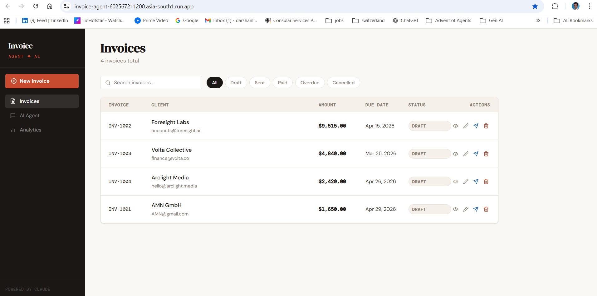
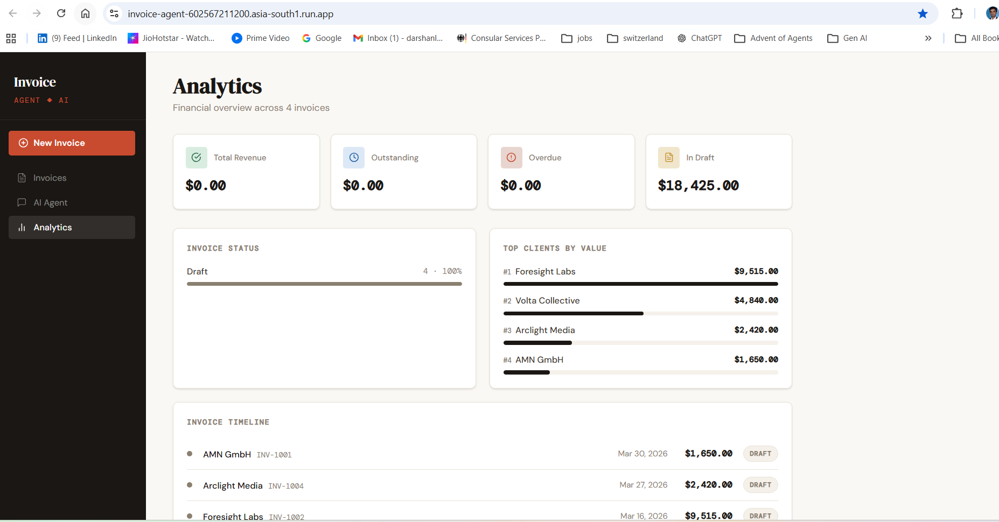
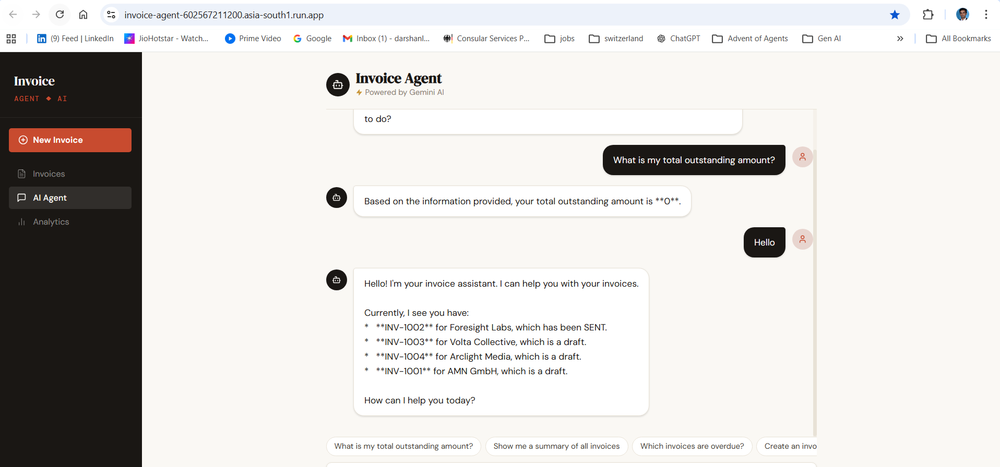

# 🚀 AI Invoice Agent (GenAI-Powered Financial Assistant)

A production-ready AI system that automates invoice workflows using conversational AI and real-time analytics.
---
## 📸 Screenshots

### Dashboard


### Analytics


### AI Agent

---

## 🧠 Problem

Manual invoicing is:
- Time-consuming  
- Error-prone  
- Lacks real-time visibility  

---

## 💡 Solution

An AI-powered invoice agent that allows users to:
- Manage invoices  
- Track payments  
- Ask financial questions in natural language  

---

## ⚙️ Tech Stack

- Frontend: React + Vite  
- Backend: Node.js (Express)  
- AI: Google Gemini 2.5 Flash  
- Deployment: Docker + Google Cloud Run  

---

## 🚀 Features

- Invoice lifecycle tracking (Draft → Paid)  
- AI chat interface for queries  
- Real-time analytics dashboard  
- Full CRUD invoice system  

---

## ⚡ Engineering Highlight

Resolved production failure caused by API version mismatch by migrating to Gemini 2.5 Flash (v1beta), ensuring stability and low latency.

---

## 📊 Impact

- ~70% faster workflows  
- Reduced manual errors  
- Real-time financial insights  

---

## 🌐 Live Demo

👉 https://invoice-agent-602567211200.asia-south1.run.app/

---

## 🛠️ Run Locally

```bash
npm install
cp .env.example .env
npm run dev
